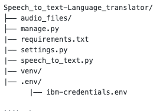

# Speech_to_text-Language_translator (Project from Python Basics for Data Science Class by Coursera)

Transcribes English audio to text and translates to any other language you select.

Currently, the speec to text funtion only works with English Audio files. To make this project work, you will have to create an instance from two IBM Services (IBM Speech to Text, and IBM Language Translator).
IBM Speech to Text is a service that converts speech in audio format into text. Watson Speech to Text is a service that uses deep learning algorithms to convert speech to text. IBM Language Translator converts one language to another.

NOTE: You will be creating an IBM Cloud account and create an instance of IBM Speech to Text and IBM Language Translator and obtain their respective API Keys. A credit card is NOT required to sign up for IBM Cloud Lite account and there is no charge associated in creating a Lite plan instance of the Watson VR service.

## Step 1: Create an IBM Cloud Account

Click on the link below to create an IBM cloud account:

Sign Up for IBM Cloud

On the page to which you get redirected by clicking on the link above, enter your email address, first name, last name, country or region, and set your password.

NOTE: To get enhanced benefits, please sign up with you company email address rather than a free email ID like Gmail, Hotmail, etc.

If you would like IBM to contact you for any changes to services or new offerings, then check the box to accept the box to get notified by email. Then click on the Create Account button to create your IBM Cloud account. **If you already have an IBM Cloud account you can just log in using the link above the Email field (top right in the screenshot below).


## Step 2: Confirm Your Email Address

An email is sent to your email address to confirm your account.


Go to your email account, and click on the "Confirm Account" link in the email that was sent to you.


## Step 3: Login to Your Account


When you click Log in, you will be redirected to a page to log into your IBM Cloud account.


## Creating IBM Services Instance 

To create a speech to text instance click Speech to Text

On the next page, you will get to name your service instance and choose your region. Click on the arrow to reveal the drop-down menu of regions. Make sure to select the region that is closest to you. Since I am located in Canada, then I am choosing Dallas as my region since it is the closest region to me.


Then scroll down and make sure that the lite plan is selected, and click the Create button.


## Step 2: Save your Speech to Text API Key

Go to Manage, then save your Speech to Text API Key, and URL you will need it for the labs in this section.


## Step 3: Create a Language Translator Instance

On the next page, you will get to name your service instance and choose your region. Click on the arrow to reveal the drop-down menu of regions. Make sure to select the region that is closest to you. Since I am located in Canada, then I am choosing Dallas as my region since it is the closest region to me.


Then scroll down and make sure that the lite plan is selected, and click the Create button.


## Step 4 : Save your Language Translator API key

Go to Manage, then save your Speech to Text API Key, and URL you will need it for the labs in this section.


## Installation 

Once you have created your account with IBM and the instances name above. Clone this repository using the following command.

```bash
git clone https://github.com/bguerrero5/Speech_to_text-Language_translator.git
```

Create a python virutal enviroment in the same directory where you clone this respositry and activate.

```bash
python3 -m venv venv

source vevn/bin/activate
```
Install requirememnts with pip.

```bash
pip install -r requirements.txt
```
Create an .env directory at the same level as the settings.py file. Then, create a file called ibm-credentials.env
inside the .env directory you just created. And input your API informaiton for the instances you just creted inside this file. You should have something like this.



```bash
mkdir .env

touch .env/ibm-credentials.env
```

Run the settings.py file to load the your api keys into your enviroment.

```bash
python3 settings.py
```
Run the manage.py file and you should see the text translation in the language you selected for the loaded audio file.

```bash
python3 manage.py
```

The current avialable languages by IBM Language Translator API please visit: https://cloud.ibm.com/apidocs/language-translator


## About the Authors:
Joseph Santarcangelo is a Data Scientist at IBM, and holds a PhD in Electrical Engineering. His research focused on using Machine Learning, Signal Processing, and Computer Vision to determine how videos impact human cognition. Joseph has been working for IBM since he completed his PhD.

Other contributors: Mavis Zhou
